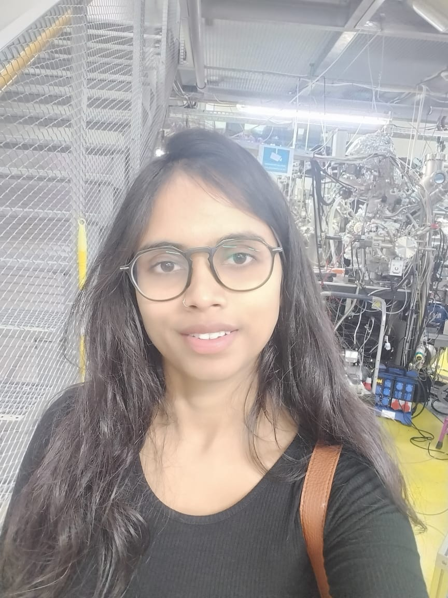

# Aishwarya Singh

  
  

**Email - aishwarya.singh@weizmann.ac.il**

[Institute](https://www.weizmann.ac.il/) | [Course]( https://szabgab.com/)

# Researcher

Hello! I am PhD student interested in theoretical and computational research focused on perovskite defects. I work with V.A.S.P. to analyze and tune the electronic structure of halide perovskites  

### Core skills

* Solid State Physics
* Numerical computation (M.A.T.L.A.B.)                       
* Density Functional Theory                                  
* Spectroscopy                                              
* V.A.S.P. (Vienna Ab initio Simulation Package)
* Photochemistry and Photophysics
* Advance material science

### Work Experience

*  computational studies of sulfur-centered unconventional hydrogen bonding
*  calculating the melt rate of the Satopanth glacier by using the Glaciological Mass Balance Method
*  Application of Density Functional Theory (DFT) in solid-state chemistry using Quantum Espresso

### Master’s Project

* Photocathodic materials for photoelectrochemical water splitting.My work focussed on chalcogenide materials as these materials are earth-abundant, cost-effective, and have good absorption power.
  
### Ph.D. Project

* Fossil fuels dominate energy consumption worldwide, resulting in many energy and environmental problems. In recent years, halide perovskites (HaP) have gained enormous attention in 
  photovoltaic research due to their direct band gap, high absorption coefficient, and long lifetime of photogenerated carriers. Defects in perovskites are responsible for most 
  problems and must be investigated thoroughly. Understanding the defect behavior experimentally is challenging as HaP forms soft-lattice crystals, resulting in the dynamical lattice, 
  ease of lattice compression/expansion, and defect diffusion. A theoretical investigation using the first principal calculation plays a vital role in understanding defect properties 
  at the atomic level, and this is our part of the research.

### Additional information

 * Secured first place in state-level science quiz at the school level
 * Participated in the National Science Olympiad
 * Curious to explore scientific problems and the approaches possible for the same
 * Participated in the Hybrid Integrated Systems for Conversion of Solar Energy (HI-SCORE) conference.

  
